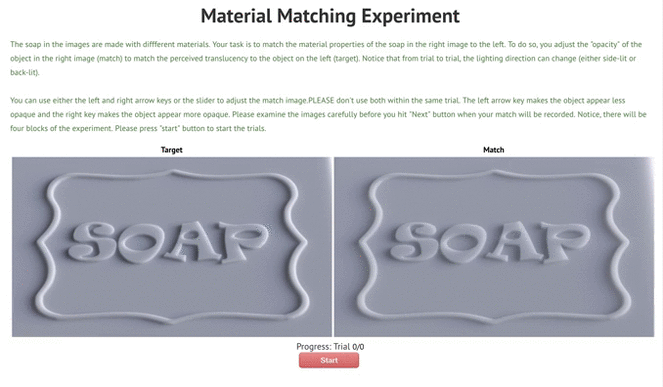

# Online Psychophysics Experiment: Asymmetric Matching Experiment
This folder contains the codes for the online asymmetric matching experiment. We used the codes to collect data for our paper [Does geometric sharpness affect perception of translucent material perception?](https://scholar.google.com/scholar?cluster=14656285582704001098&hl=en&oi=scholarr).

## Dependencies
The codes are written in HTML/CSS/Javascript/PHP/MySQL and have been tested with:
* PHP 5.6.30 
* MySQL 5.6.37
* jQuery 1.12.4, minified


## Usage
1. **Experimental Procedure:** Subjects change the material properties of the match image (right) until it matches the target image (left) by sliding the slider bar with mouse or pressing the left/right arrow keys. During anytime of the experiment, subjects can click the "Show Instruction" button to read the instruction. 

<div class="image12">
<!--     <p align="center"> Experimental Interface </strong></p> -->
    <p align="center"></p>
</div>

2. **Saving data**: The default subject name is "test". By default, the data are saved as .json files in the folder "[results/[subject name]](results/test)". <br/><br/>If you want to save the data to MySQL dataset:
   - In "[js/main.js](js/main.js)": use 

      ```javascript 
      //var dataSaveFile = 'modulus/@WriteDataJSON.php'; 
      var dataSaveFile = 'modulus/@WriteDataSQL.php'; 
      ```
   - In "[modulus/Database_config.php](modulus/@Database_config.php)", set your SQL configuration:
   
      ```php 
      $servername = "localhost";
      //$port=3306;
      $username = "root";
      $password = "mysql";
      $dbname = "myResults";            // [wb]: Database name
      $table = "Trans_matching_data";  // [wb]: Table name
      ```
3. **Folder description **:
* [results](results/): Stores the saved .json data files (var dataSaveFile = 'modulus/@WriteDataJSON.php';).
