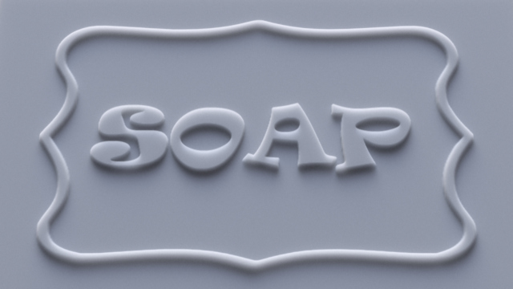
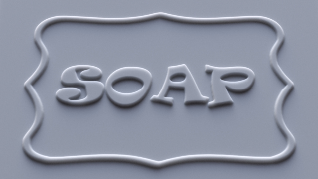
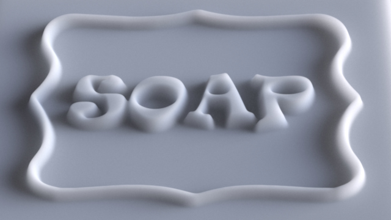
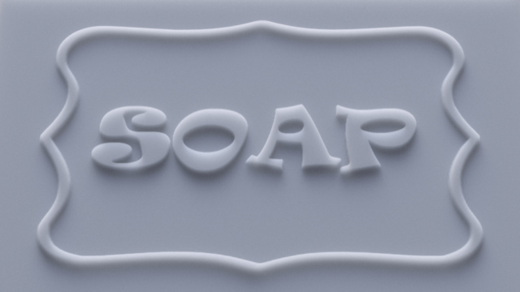

[](https://github.com/BumbleBee0819/OnlinePsychophysicsExperiment_AsymmetricMatching/issues/)
[](https://opensource.org/licenses/MIT)
[]()
[]()
[]()


> since 2019-10-13

<h1> Online Psychophysics Experiment: Asymmetric Matching </h1>

<p align="center">

This folder contains the codes for the online asymmetric matching experiment, which are used in our paper [Effect of Geometric Sharpness on Translucent Material Perception](https://www.biorxiv.org/content/10.1101/795294v1?rss=1).

</p>

## Dependencies
The codes are written in HTML/CSS/Javascript/PHP/MySQL and have been tested with:
* [PHP 5.6.30](https://www.php.net/releases/5_6_30.php) 
* [MySQL 5.6.37](https://dev.mysql.com/doc/relnotes/mysql/5.6/en/news-5-6-37.html)
* [jQuery 1.12.4, minified](https://blog.jquery.com/2016/05/20/jquery-1-12-4-and-2-2-4-released/)


## Usage
1. **Experimental Procedure:** Subjects change the material properties of the match image (right) until it matches the target image (left) by sliding the slider bar with the mouse or pressing the left/right arrow keys. During any time of the experiment, subjects can click the "Show Instruction" button to read the instruction. 

<div class="image12">
<!--     <p align="center"> Experimental Interface </strong></p> -->
    <p align="center"></p>
</div>

2. **Saving data**: The default subject name is "test". By default, the data are saved as .json files in the folder "[results/[subject name]](results/test)". <br/><br/>If you want to save the data to MySQL dataset:
   - In "[js/main.js](js/main.js)": use 

      ```javascript 
      //var dataSaveFile = 'modulus/@WriteDataJSON.php'; 
      var dataSaveFile = 'modulus/@WriteDataSQL.php'; 
      ```
   - In "[modulus/Database_config.php](modulus/@Database_config.php)", set your SQL configuration:
   
      ```php 
      $servername = "localhost";
      //$port=3306;
      $username = "root";
      $password = "mysql";
      $dbname = "myResults";            // [wb]: Database name
      $table = "Trans_matching_data";  // [wb]: Table name
      ```
   -  To export data from the dataset. In terminal:
      ```bash
      SELECT * FROM [TableName: e.g., Trans_matching_data] INTO OUTFILE [Absolute path: e.g., '/Users/Fiona/tmp.txt']
      FIELDS TERMINATED BY ',' ENCLOSED BY '"'
      LINES TERMINATED BY '\r\n';
      ``` 

3. **Folder description:**
    * [conditions](conditions/): The condition files for each subject. Will be automatically generated for the new subjects.
    * [conditions](css/): Main style sheet.
    * [img](img/): Images that be used in HTML.
    * [js](js/): Main Javascript.
    * [modulus](modulus/): Php codes.
    * [results](results/): Stores the saved .json data files (when `var dataSaveFile = 'modulus/@WriteDataJSON.php'`).
    * [stimuli](stimuli/): Image stimuli that are used in the experiment.


4. **Using Localhost:** The codes can be run locally using [Ampps](https://www.ampps.com/downloads). After downloading the software, open terminal to setup AMPPS localhost:
      ```bash
      # MacOS configuration:
      ln -s [Path/To/Online_AsymmetricMatchingExperiment/Folder] /Applications/AMPPS/www
      ```
## Contact
If you have any questions, please contact "wb1918a@american.edu".
